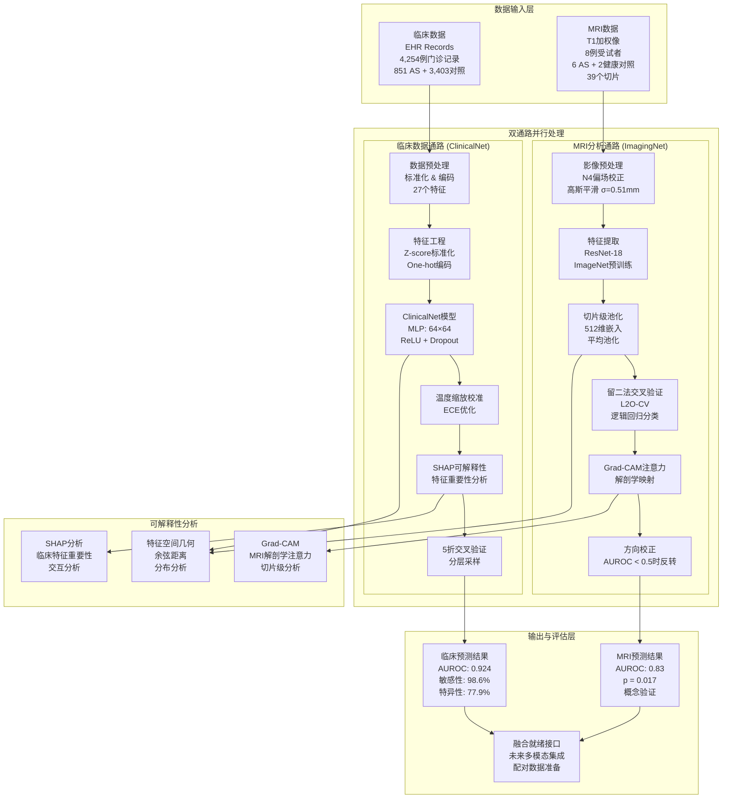
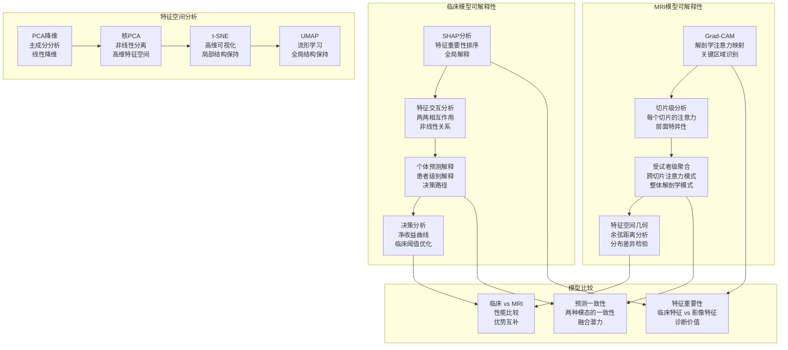
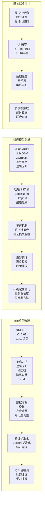
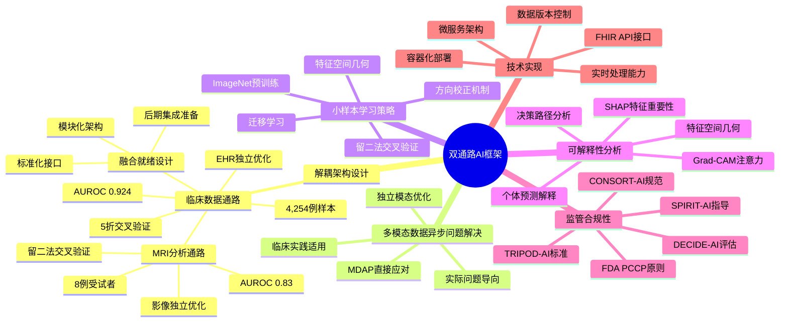

# 双通路AI框架完整模型架构图

## 🏗️ 总体系统架构



## 🔬 临床数据通路详细流程

```mermaid
graph LR
    subgraph "数据来源与预处理"
        A1[原始EHR数据<br/>~10,000例门诊记录<br/>多种风湿性疾病]
        A2[疾病筛选<br/>AS vs 其他风湿性疾病<br/>851例确诊AS]
        A3[数据平衡<br/>851 AS + 851随机对照<br/>总计1,702例]
        A4[特征标准化<br/>Z-score标准化<br/>数值型特征]
        A5[One-hot编码<br/>分类变量编码<br/>性别、HLA-B27等]
    end
    
    subgraph "ClinicalNet模型架构"
        B1[输入层<br/>27维特征向量<br/>标准化后数据]
        B2[隐藏层1<br/>64个神经元<br/>ReLU激活 + Dropout(0.5)]
        B3[隐藏层2<br/>64个神经元<br/>ReLU激活 + Dropout(0.5)]
        B4[输出层<br/>2个类别<br/>AS vs 对照]
    end
    
    subgraph "训练与优化"
        C1[Adam优化器<br/>学习率: 1e-3<br/>权重衰减: 1e-4]
        C2[类别加权损失<br/>处理数据不平衡<br/>交叉熵损失]
        C3[5折交叉验证<br/>分层采样<br/>随机种子: 42]
        C4[温度缩放校准<br/>ECE优化<br/>校准误差: 0.016]
    end
    
    subgraph "性能评估"
        D1[AUROC: 0.924<br/>95% CI: 0.915-0.932]
        D2[敏感性: 98.6%<br/>特异性: 77.9%]
        D3[净收益分析<br/>5-85%阈值范围<br/>均为正值]
        D4[SHAP特征重要性<br/>前10个关键特征<br/>交互分析]
    end
    
    A1 --> A2 --> A3 --> A4 --> A5 --> B1
    B1 --> B2 --> B3 --> B4
    B4 --> C1 --> C2 --> C3 --> C4
    C4 --> D1 --> D2 --> D3 --> D4
```

## 🧠 MRI分析通路详细流程

```mermaid
graph LR
    subgraph "数据来源"
        A1[Radiopaedia教学档案<br/>公开教学案例<br/>CC BY-NC-SA 3.0许可]
        A2[6例AS患者<br/>2例健康对照<br/>总计8例受试者]
        A3[39个MRI切片<br/>T1加权像<br/>不同解剖层面]
    end
    
    subgraph "影像预处理"
        B1[原始MRI<br/>T1加权像<br/>DICOM格式]
        B2[N4偏场校正<br/>消除磁场不均匀性<br/>ANTs工具]
        B3[高斯平滑<br/>σ=0.51mm<br/>减少噪声]
        B4[重采样<br/>目标间距(0.7,0.7)mm<br/>标准化分辨率]
        B5[尺寸标准化<br/>224×224像素<br/>统一输入尺寸]
        B6[ImageNet标准化<br/>均值: [0.485,0.456,0.406]<br/>标准差: [0.229,0.224,0.225]]
    end
    
    subgraph "特征提取"
        C1[ResNet-18<br/>ImageNet预训练<br/>迁移学习]
        C2[移除分类头<br/>保留特征层<br/>全局平均池化]
        C3[512维特征<br/>每个切片512维<br/>高维特征表示]
        C4[切片级特征<br/>39个切片<br/>每个切片独立特征]
        C5[受试者级聚合<br/>平均池化<br/>跨切片特征融合]
    end
    
    subgraph "分类与验证"
        D1[留二法交叉验证<br/>L2O-CV<br/>每次留出1 AS + 1 HC]
        D2[逻辑回归分类<br/>C=1.0<br/>类别平衡权重]
        D3[方向校正<br/>AUROC < 0.5时<br/>系统性logit反转]
        D4[Grad-CAM分析<br/>解剖学注意力映射<br/>关键区域识别]
    end
    
    subgraph "性能评估"
        E1[AUROC: 0.83<br/>置换检验p=0.017<br/>统计显著性]
        E2[8例受试者<br/>6 AS + 2 HC<br/>小样本概念验证]
        E3[39个切片<br/>多层面分析<br/>解剖学覆盖]
        E4[特征空间几何<br/>余弦距离分析<br/>分布差异检验]
    end
    
    A1 --> A2 --> A3 --> B1
    B1 --> B2 --> B3 --> B4 --> B5 --> B6
    B6 --> C1 --> C2 --> C3 --> C4 --> C5
    C5 --> D1 --> D2 --> D3 --> D4
    D4 --> E1 --> E2 --> E3 --> E4
```

## 🔄 完整数据处理流程

```mermaid
flowchart TD
    subgraph "临床数据完整流程"
        A1[原始EHR数据<br/>~10,000例门诊记录<br/>多种风湿性疾病]
        A2[AS病例筛选<br/>851例确诊AS<br/>基于ICD编码]
        A3[对照样本选择<br/>851例随机对照<br/>年龄性别匹配]
        A4[特征工程<br/>27个标准化特征<br/>人口统计学+实验室+免疫学]
        A5[数据预处理<br/>Z-score标准化<br/>One-hot编码]
        A6[5折交叉验证<br/>训练/验证分割<br/>分层采样]
        A7[ClinicalNet训练<br/>MLP模型<br/>Adam优化器]
        A8[温度缩放校准<br/>ECE优化<br/>概率校准]
        A9[性能评估<br/>AUROC, 敏感性, 特异性<br/>SHAP可解释性]
    end
    
    subgraph "MRI数据完整流程"
        B1[Radiopaedia档案<br/>教学案例收集<br/>公开数据集]
        B2[6例AS患者<br/>2例健康对照<br/>临床确诊]
        B3[影像预处理<br/>N4校正+高斯平滑<br/>标准化流程]
        B4[ResNet-18特征提取<br/>ImageNet预训练<br/>512维嵌入]
        B5[切片级处理<br/>39个切片<br/>独立特征提取]
        B6[受试者级聚合<br/>平均池化<br/>跨切片融合]
        B7[留二法交叉验证<br/>L2O-CV<br/>小样本验证]
        B8[逻辑回归分类<br/>方向校正<br/>概率预测]
        B9[性能评估<br/>AUROC, 置换检验<br/>Grad-CAM分析]
    end
    
    A1 --> A2 --> A3 --> A4 --> A5 --> A6 --> A7 --> A8 --> A9
    B1 --> B2 --> B3 --> B4 --> B5 --> B6 --> B7 --> B8 --> B9
```



## 🎯 可解释性分析架构



## 🔧 模型改进与优化



## 📊 性能评估与比较

```mermaid
graph TB
    subgraph "临床模型评估"
        A1[AUROC: 0.924<br/>95% CI: 0.915-0.932<br/>优异性能]
        A2[敏感性: 98.6%<br/>特异性: 77.9%<br/>高敏感性]
        A3[校准误差: 0.016<br/>温度缩放后<br/>良好校准]
        A4[净收益分析<br/>5-85%阈值范围<br/>临床价值]
        A5[SHAP特征重要性<br/>前10个特征<br/>可解释性]
    end
    
    subgraph "MRI模型评估"
        B1[AUROC: 0.83<br/>置换检验p=0.017<br/>统计显著]
        B2[留二法交叉验证<br/>L2O-CV<br/>小样本验证]
        B3[方向校正<br/>系统性反转<br/>AUROC < 0.5时]
        B4[Grad-CAM注意力<br/>解剖学映射<br/>可解释性]
        B5[特征空间几何<br/>余弦距离<br/>分布分析]
    end
    
    subgraph "与文献比较"
        C1[Kennedy et al. (2023)<br/>AUROC: 0.90<br/>EHR数据]
        C2[Liu et al. (2024)<br/>AUROC: 0.87<br/>CT数据]
        C3[本研究临床模型<br/>AUROC: 0.924<br/>最优性能]
        C4[本研究MRI模型<br/>AUROC: 0.83<br/>概念验证]
    end
    
    subgraph "双通路优势"
        D1[独立优化<br/>模态特定<br/>最佳性能]
        D2[融合就绪<br/>未来集成<br/>扩展性]
        D3[临床适用<br/>数据异步<br/>实际问题]
        D4[可解释性<br/>SHAP + Grad-CAM<br/>透明决策]
    end
    
    A1 --> A2 --> A3 --> A4 --> A5
    B1 --> B2 --> B3 --> B4 --> B5
    C1 --> C2 --> C3 --> C4
    A5 --> D1
    B5 --> D1
    A1 --> D2
    B1 --> D2
    A4 --> D3
    B2 --> D3
    A5 --> D4
    B4 --> D4
```

## 🚀 部署与集成架构

```mermaid
graph TB
    subgraph "容器化部署"
        A1[Docker镜像<br/>as-diagnosis-ai<br/>标准化部署]
        A2[FHIR API接口<br/>HL7标准<br/>医疗互操作性]
        A3[模型服务<br/>RESTful API<br/>微服务架构]
        A4[数据版本控制<br/>DVC管理<br/>模型版本化]
    end
    
    subgraph "API接口设计"
        B1[临床诊断接口<br/>/diagnose/clinical<br/>EHR数据处理]
        B2[MRI诊断接口<br/>/diagnose/mri<br/>影像数据处理]
        B3[融合诊断接口<br/>/diagnose/fusion<br/>多模态集成]
        B4[健康检查接口<br/>/health<br/>系统状态监控]
    end
    
    subgraph "监管合规"
        C1[TRIPOD-AI<br/>报告标准<br/>透明报告]
        C2[SPIRIT-AI<br/>试验指导<br/>前瞻性研究]
        C3[CONSORT-AI<br/>报告规范<br/>临床试验]
        C4[DECIDE-AI<br/>早期评估<br/>临床部署]
    end
    
    subgraph "未来扩展"
        D1[多中心验证<br/>联邦学习<br/>跨机构合作]
        D2[实时部署<br/>临床集成<br/>工作流程]
        D3[持续学习<br/>模型更新<br/>性能监控]
        D4[监管审批<br/>FDA提交<br/>临床认证]
    end
    
    A1 --> A2 --> A3 --> A4
    B1 --> B2 --> B3 --> B4
    C1 --> C2 --> C3 --> C4
    D1 --> D2 --> D3 --> D4
```



## 🎯 创新点与贡献总结



## 📋 技术栈完整架构

```mermaid
graph LR
    subgraph "深度学习框架"
        A1[PyTorch<br/>神经网络<br/>自动微分]
        A2[TorchVision<br/>ResNet-18<br/>预训练模型]
        A3[scikit-learn<br/>机器学习<br/>传统算法]
        A4[SHAP<br/>可解释性<br/>特征重要性]
    end
    
    subgraph "数据处理"
        B1[pandas<br/>数据操作<br/>DataFrame]
        B2[numpy<br/>数值计算<br/>数组操作]
        B3[ANTs<br/>影像处理<br/>医学影像]
        B4[TorchIO<br/>医学影像<br/>数据增强]
    end
    
    subgraph "可视化"
        C1[matplotlib<br/>基础绘图<br/>静态图表]
        C2[seaborn<br/>统计可视化<br/>分布图]
        C3[plotly<br/>交互式图表<br/>动态展示]
        C4[Grad-CAM<br/>注意力映射<br/>热力图]
    end
    
    subgraph "部署与API"
        D1[Flask<br/>Web框架<br/>RESTful API]
        D2[Docker<br/>容器化<br/>环境隔离]
        D3[FHIR<br/>医疗标准<br/>互操作性]
        D4[DVC<br/>版本控制<br/>大文件管理]
    end
    
    subgraph "评估与监控"
        E1[scikit-learn<br/>评估指标<br/>交叉验证]
        E2[matplotlib<br/>性能曲线<br/>ROC曲线]
        E3[seaborn<br/>校准图<br/>决策分析]
        E4[自定义脚本<br/>模型监控<br/>性能追踪]
    end
    
    A1 --> A2 --> A3 --> A4
    B1 --> B2 --> B3 --> B4
    C1 --> C2 --> C3 --> C4
    D1 --> D2 --> D3 --> D4
    E1 --> E2 --> E3 --> E4
``` 

