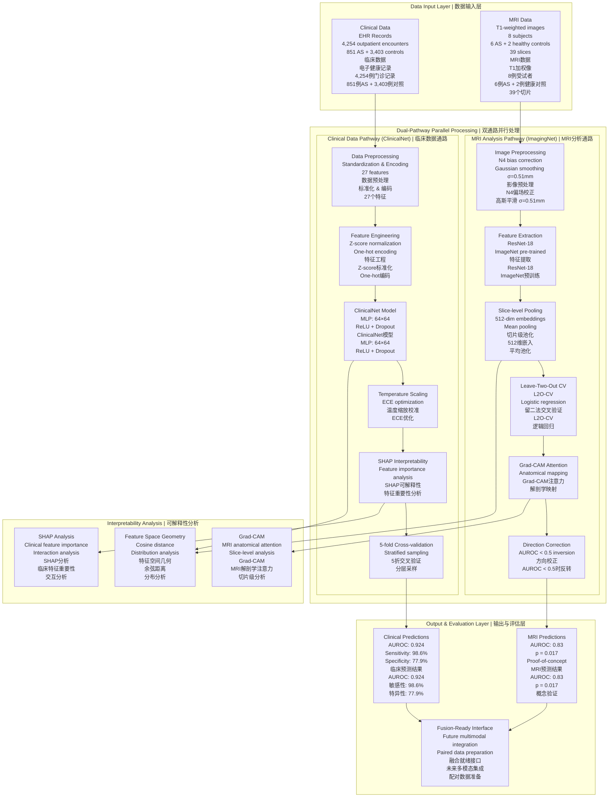
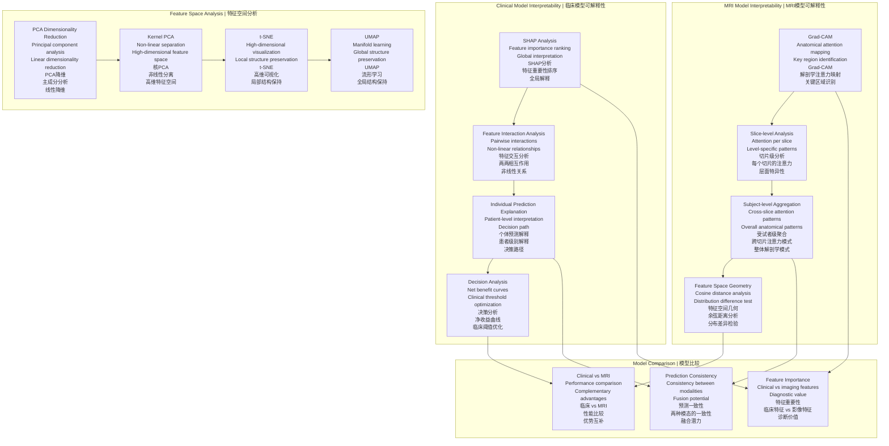
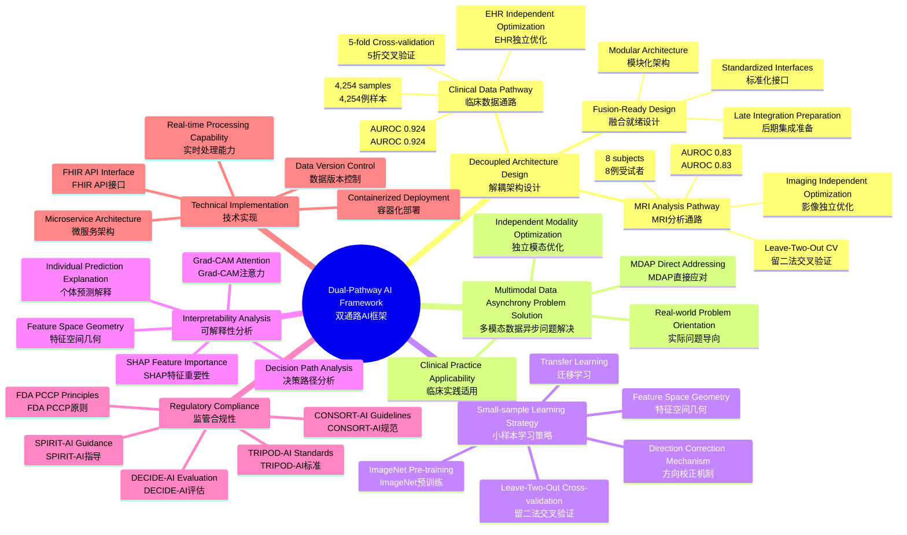

# Dual-Pathway AI Framework: Complete Model Architecture
# 双通路AI框架：完整模型架构图

## 🏗️ Overall System Architecture | 总体系统架构



## 🔬 Clinical Data Pathway Detailed Flow | 临床数据通路详细流程

```mermaid
flowchart TD
    subgraph "Data Source & Preprocessing | 数据来源与预处理"
        A1[Raw EHR Data<br/>~10,000 outpatient encounters<br/>Multiple rheumatic diseases<br/>原始EHR数据<br/>~10,000例门诊记录<br/>多种风湿性疾病]
        A2[Disease Filtering<br/>AS vs other rheumatic diseases<br/>851 confirmed AS cases<br/>疾病筛选<br/>AS vs 其他风湿性疾病<br/>851例确诊AS]
        A3[Data Balancing<br/>851 AS + 851 random controls<br/>Total 1,702 samples<br/>数据平衡<br/>851 AS + 851随机对照<br/>总计1,702例]
        A4[Feature Standardization<br/>Z-score normalization<br/>Numerical features<br/>特征标准化<br/>Z-score标准化<br/>数值型特征]
        A5[One-hot Encoding<br/>Categorical variables<br/>Gender, HLA-B27, etc.<br/>One-hot编码<br/>分类变量编码<br/>性别、HLA-B27等]
    end
    
    subgraph "ClinicalNet Model Architecture | ClinicalNet模型架构"
        B1[Input Layer<br/>27-dim feature vector<br/>Standardized data<br/>输入层<br/>27维特征向量<br/>标准化后数据]
        B2[Hidden Layer 1<br/>64 neurons<br/>ReLU + Dropout(0.5)<br/>隐藏层1<br/>64个神经元<br/>ReLU + Dropout(0.5)]
        B3[Hidden Layer 2<br/>64 neurons<br/>ReLU + Dropout(0.5)<br/>隐藏层2<br/>64个神经元<br/>ReLU + Dropout(0.5)]
        B4[Output Layer<br/>2 classes<br/>AS vs control<br/>输出层<br/>2个类别<br/>AS vs 对照]
    end
    
    subgraph "Training & Optimization | 训练与优化"
        C1[Adam Optimizer<br/>Learning rate: 1e-3<br/>Weight decay: 1e-4<br/>Adam优化器<br/>学习率: 1e-3<br/>权重衰减: 1e-4]
        C2[Class-weighted Loss<br/>Handle data imbalance<br/>Cross-entropy loss<br/>类别加权损失<br/>处理数据不平衡<br/>交叉熵损失]
        C3[5-fold Cross-validation<br/>Stratified sampling<br/>Random seed: 42<br/>5折交叉验证<br/>分层采样<br/>随机种子: 42]
        C4[Temperature Scaling<br/>ECE optimization<br/>Calibration error: 0.016<br/>温度缩放校准<br/>ECE优化<br/>校准误差: 0.016]
    end
    
    subgraph "Performance Evaluation | 性能评估"
        D1[AUROC: 0.924<br/>95% CI: 0.915-0.932<br/>AUROC: 0.924<br/>95% CI: 0.915-0.932]
        D2[Sensitivity: 98.6%<br/>Specificity: 77.9%<br/>敏感性: 98.6%<br/>特异性: 77.9%]
        D3[Net Benefit Analysis<br/>5-85% threshold range<br/>All positive values<br/>净收益分析<br/>5-85%阈值范围<br/>均为正值]
        D4[SHAP Feature Importance<br/>Top 10 key features<br/>Interaction analysis<br/>SHAP特征重要性<br/>前10个关键特征<br/>交互分析]
    end
    
    A1 --> A2 --> A3 --> A4 --> A5 --> B1
    B1 --> B2 --> B3 --> B4
    B4 --> C1 --> C2 --> C3 --> C4
    C4 --> D1 --> D2 --> D3 --> D4
```

## 🧠 MRI Analysis Pathway Detailed Flow | MRI分析通路详细流程

```mermaid
flowchart TD
    subgraph "Data Source | 数据来源"
        A1[Radiopaedia Teaching Archive<br/>Public teaching cases<br/>CC BY-NC-SA 3.0 license<br/>Radiopaedia教学档案<br/>公开教学案例<br/>CC BY-NC-SA 3.0许可]
        A2[6 AS patients<br/>2 healthy controls<br/>Total 8 subjects<br/>6例AS患者<br/>2例健康对照<br/>总计8例受试者]
        A3[39 MRI slices<br/>T1-weighted images<br/>Different anatomical levels<br/>39个MRI切片<br/>T1加权像<br/>不同解剖层面]
    end
    
    subgraph "Image Preprocessing | 影像预处理"
        B1[Raw MRI<br/>T1-weighted images<br/>DICOM format<br/>原始MRI<br/>T1加权像<br/>DICOM格式]
        B2[N4 Bias Correction<br/>Eliminate field inhomogeneity<br/>ANTs toolkit<br/>N4偏场校正<br/>消除磁场不均匀性<br/>ANTs工具]
        B3[Gaussian Smoothing<br/>σ=0.51mm<br/>Noise reduction<br/>高斯平滑<br/>σ=0.51mm<br/>减少噪声]
        B4[Resampling<br/>Target spacing (0.7,0.7)mm<br/>Standardized resolution<br/>重采样<br/>目标间距(0.7,0.7)mm<br/>标准化分辨率]
        B5[Size Standardization<br/>224×224 pixels<br/>Uniform input size<br/>尺寸标准化<br/>224×224像素<br/>统一输入尺寸]
        B6[ImageNet Normalization<br/>Mean: [0.485,0.456,0.406]<br/>Std: [0.229,0.224,0.225]<br/>ImageNet标准化<br/>均值: [0.485,0.456,0.406]<br/>标准差: [0.229,0.224,0.225]]
    end
    
    subgraph "Feature Extraction | 特征提取"
        C1[ResNet-18<br/>ImageNet pre-trained<br/>Transfer learning<br/>ResNet-18<br/>ImageNet预训练<br/>迁移学习]
        C2[Remove Classification Head<br/>Retain feature layers<br/>Global average pooling<br/>移除分类头<br/>保留特征层<br/>全局平均池化]
        C3[512-dim Features<br/>512-dim per slice<br/>High-dimensional representation<br/>512维特征<br/>每个切片512维<br/>高维特征表示]
        C4[Slice-level Features<br/>39 slices<br/>Independent features per slice<br/>切片级特征<br/>39个切片<br/>每个切片独立特征]
        C5[Subject-level Aggregation<br/>Mean pooling<br/>Cross-slice feature fusion<br/>受试者级聚合<br/>平均池化<br/>跨切片特征融合]
    end
    
    subgraph "Classification & Validation | 分类与验证"
        D1[Leave-Two-Out CV<br/>L2O-CV<br/>Leave 1 AS + 1 HC each time<br/>留二法交叉验证<br/>L2O-CV<br/>每次留出1 AS + 1 HC]
        D2[Logistic Regression<br/>C=1.0<br/>Class-balanced weights<br/>逻辑回归分类<br/>C=1.0<br/>类别平衡权重]
        D3[Direction Correction<br/>Systematic inversion<br/>When AUROC < 0.5<br/>方向校正<br/>系统性反转<br/>AUROC < 0.5时]
        D4[Grad-CAM Analysis<br/>Anatomical attention mapping<br/>Key region identification<br/>Grad-CAM分析<br/>解剖学注意力映射<br/>关键区域识别]
    end
    
    subgraph "Performance Evaluation | 性能评估"
        E1[AUROC: 0.83<br/>Permutation test p=0.017<br/>Statistical significance<br/>AUROC: 0.83<br/>置换检验p=0.017<br/>统计显著性]
        E2[8 subjects<br/>6 AS + 2 HC<br/>Small-sample proof-of-concept<br/>8例受试者<br/>6 AS + 2 HC<br/>小样本概念验证]
        E3[39 slices<br/>Multi-level analysis<br/>Anatomical coverage<br/>39个切片<br/>多层面分析<br/>解剖学覆盖]
        E4[Feature Space Geometry<br/>Cosine distance analysis<br/>Distribution difference test<br/>特征空间几何<br/>余弦距离分析<br/>分布差异检验]
    end
    
    A1 --> A2 --> A3 --> B1
    B1 --> B2 --> B3 --> B4 --> B5 --> B6
    B6 --> C1 --> C2 --> C3 --> C4 --> C5
    C5 --> D1 --> D2 --> D3 --> D4
    D4 --> E1 --> E2 --> E3 --> E4
```

## 🔄 Complete Data Processing Pipeline | 完整数据处理流程

```mermaid
flowchart TD
    subgraph "Clinical Data Complete Pipeline | 临床数据完整流程"
        A1[Raw EHR Data<br/>~10,000 outpatient encounters<br/>Multiple rheumatic diseases<br/>原始EHR数据<br/>~10,000例门诊记录<br/>多种风湿性疾病]
        A2[AS Case Selection<br/>851 confirmed AS cases<br/>Based on ICD codes<br/>AS病例筛选<br/>851例确诊AS<br/>基于ICD编码]
        A3[Control Sample Selection<br/>851 random controls<br/>Age-gender matched<br/>对照样本选择<br/>851例随机对照<br/>年龄性别匹配]
        A4[Feature Engineering<br/>27 standardized features<br/>Demographics + Lab + Immunology<br/>特征工程<br/>27个标准化特征<br/>人口统计学+实验室+免疫学]
        A5[Data Preprocessing<br/>Z-score normalization<br/>One-hot encoding<br/>数据预处理<br/>Z-score标准化<br/>One-hot编码]
        A6[5-fold Cross-validation<br/>Train/validation split<br/>Stratified sampling<br/>5折交叉验证<br/>训练/验证分割<br/>分层采样]
        A7[ClinicalNet Training<br/>MLP model<br/>Adam optimizer<br/>ClinicalNet训练<br/>MLP模型<br/>Adam优化器]
        A8[Temperature Scaling Calibration<br/>ECE optimization<br/>Probability calibration<br/>温度缩放校准<br/>ECE优化<br/>概率校准]
        A9[Performance Evaluation<br/>AUROC, Sensitivity, Specificity<br/>SHAP interpretability<br/>性能评估<br/>AUROC, 敏感性, 特异性<br/>SHAP可解释性]
    end
    
    subgraph "MRI Data Complete Pipeline | MRI数据完整流程"
        B1[Radiopaedia Archive<br/>Teaching case collection<br/>Public dataset<br/>Radiopaedia档案<br/>教学案例收集<br/>公开数据集]
        B2[6 AS patients<br/>2 healthy controls<br/>Clinically confirmed<br/>6例AS患者<br/>2例健康对照<br/>临床确诊]
        B3[Image Preprocessing<br/>N4 correction + Gaussian smoothing<br/>Standardized pipeline<br/>影像预处理<br/>N4校正+高斯平滑<br/>标准化流程]
        B4[ResNet-18 Feature Extraction<br/>ImageNet pre-trained<br/>512-dim embeddings<br/>ResNet-18特征提取<br/>ImageNet预训练<br/>512维嵌入]
        B5[Slice-level Processing<br/>39 slices<br/>Independent feature extraction<br/>切片级处理<br/>39个切片<br/>独立特征提取]
        B6[Subject-level Aggregation<br/>Mean pooling<br/>Cross-slice fusion<br/>受试者级聚合<br/>平均池化<br/>跨切片融合]
        B7[Leave-Two-Out Cross-validation<br/>L2O-CV<br/>Small-sample validation<br/>留二法交叉验证<br/>L2O-CV<br/>小样本验证]
        B8[Logistic Regression Classification<br/>Direction correction<br/>Probability prediction<br/>逻辑回归分类<br/>方向校正<br/>概率预测]
        B9[Performance Evaluation<br/>AUROC, Permutation test<br/>Grad-CAM analysis<br/>性能评估<br/>AUROC, 置换检验<br/>Grad-CAM分析]
    end
    
    A1 --> A2 --> A3 --> A4 --> A5 --> A6 --> A7 --> A8 --> A9
    B1 --> B2 --> B3 --> B4 --> B5 --> B6 --> B7 --> B8 --> B9
```



## 🎯 Interpretability Analysis Architecture | 可解释性分析架构



## 🔧 Model Improvement & Optimization | 模型改进与优化

```mermaid
flowchart TD
    subgraph "MRI Model Improvements | MRI模型改进"
        A1[Strong Regularization<br/>C=0.01<br/>L1/L2 penalties<br/>强正则化<br/>C=0.01<br/>L1/L2惩罚]
        A2[Ensemble Methods<br/>Logistic Regression<br/>Ridge Regression<br/>Random Forest<br/>SVM<br/>集成方法<br/>逻辑回归<br/>岭回归<br/>随机森林<br/>SVM]
        A3[Data Augmentation<br/>Rotation<br/>Brightness adjustment<br/>Contrast adjustment<br/>数据增强<br/>旋转<br/>亮度调整<br/>对比度调整]
        A4[Feature Standardization<br/>Z-score standardization<br/>Feature scaling<br/>特征标准化<br/>Z-score标准化<br/>特征缩放]
        A5[Overfitting Detection<br/>Validation curves<br/>Learning curves<br/>过拟合检测<br/>验证曲线<br/>学习曲线]
    end
    
    subgraph "Clinical Model Improvements | 临床模型改进"
        B1[Multi-algorithm Ensemble<br/>LightGBM<br/>XGBoost<br/>Neural Network<br/>Logistic Regression<br/>多算法集成<br/>LightGBM<br/>XGBoost<br/>神经网络<br/>逻辑回归]
        B2[Improved NN Architecture<br/>BatchNorm<br/>Dropout<br/>Residual connections<br/>改进NN架构<br/>BatchNorm<br/>Dropout<br/>残差连接]
        B3[Early Stopping Mechanism<br/>Prevent overfitting<br/>Validation loss monitoring<br/>早停机制<br/>防止过拟合<br/>验证损失监控]
        B4[Better Calibration<br/>Temperature scaling<br/>Platt scaling<br/>更好校准<br/>温度缩放<br/>Platt缩放]
        B5[Uncertainty Quantification<br/>Prediction confidence<br/>Bayesian methods<br/>不确定性量化<br/>预测置信度<br/>贝叶斯方法]
    end
    
    subgraph "Fusion-Ready Design | 融合就绪设计"
        C1[Modular Architecture<br/>Independent pathways<br/>Standardized interfaces<br/>模块化架构<br/>独立通路<br/>标准化接口]
        C2[API Compatibility<br/>RESTful interfaces<br/>FHIR standards<br/>API兼容<br/>RESTful接口<br/>FHIR标准]
        C3[Late Fusion<br/>Meta-learning<br/>Ensemble learning<br/>后期融合<br/>元学习<br/>集成学习]
        C4[Multimodal Integration<br/>Paired data<br/>Joint training<br/>多模态集成<br/>配对数据<br/>联合训练]
    end
    
    A1 --> A2 --> A3 --> A4 --> A5
    B1 --> B2 --> B3 --> B4 --> B5
    C1 --> C2 --> C3 --> C4
```



## 📊 Performance Evaluation & Comparison | 性能评估与比较

```mermaid
flowchart TD
    subgraph "Clinical Model Evaluation | 临床模型评估"
        A1[AUROC: 0.924<br/>95% CI: 0.915-0.932<br/>Excellent performance<br/>AUROC: 0.924<br/>95% CI: 0.915-0.932<br/>优异性能]
        A2[Sensitivity: 98.6%<br/>Specificity: 77.9%<br/>High sensitivity<br/>敏感性: 98.6%<br/>特异性: 77.9%<br/>高敏感性]
        A3[Calibration Error: 0.016<br/>After temperature scaling<br/>Good calibration<br/>校准误差: 0.016<br/>温度缩放后<br/>良好校准]
        A4[Net Benefit Analysis<br/>5-85% threshold range<br/>Clinical value<br/>净收益分析<br/>5-85%阈值范围<br/>临床价值]
        A5[SHAP Feature Importance<br/>Top 10 features<br/>Interpretability<br/>SHAP特征重要性<br/>前10个特征<br/>可解释性]
    end
    
    subgraph "MRI Model Evaluation | MRI模型评估"
        B1[AUROC: 0.83<br/>Permutation test p=0.017<br/>Statistically significant<br/>AUROC: 0.83<br/>置换检验p=0.017<br/>统计显著]
        B2[Leave-Two-Out Cross-validation<br/>L2O-CV<br/>Small-sample validation<br/>留二法交叉验证<br/>L2O-CV<br/>小样本验证]
        B3[Direction Correction<br/>Systematic inversion<br/>When AUROC < 0.5<br/>方向校正<br/>系统性反转<br/>AUROC < 0.5时]
        B4[Grad-CAM Attention<br/>Anatomical mapping<br/>Interpretability<br/>Grad-CAM注意力<br/>解剖学映射<br/>可解释性]
        B5[Feature Space Geometry<br/>Cosine distance<br/>Distribution analysis<br/>特征空间几何<br/>余弦距离<br/>分布分析]
    end
    
    subgraph "Literature Comparison | 与文献比较"
        C1[Kennedy et al. (2023)<br/>AUROC: 0.90<br/>EHR data<br/>Kennedy et al. (2023)<br/>AUROC: 0.90<br/>EHR数据]
        C2[Liu et al. (2024)<br/>AUROC: 0.87<br/>CT data<br/>Liu et al. (2024)<br/>AUROC: 0.87<br/>CT数据]
        C3[Our Clinical Model<br/>AUROC: 0.924<br/>Best performance<br/>本研究临床模型<br/>AUROC: 0.924<br/>最优性能]
        C4[Our MRI Model<br/>AUROC: 0.83<br/>Proof-of-concept<br/>本研究MRI模型<br/>AUROC: 0.83<br/>概念验证]
    end
    
    subgraph "Dual-Pathway Advantages | 双通路优势"
        D1[Independent Optimization<br/>Modality-specific<br/>Best performance<br/>独立优化<br/>模态特定<br/>最佳性能]
        D2[Fusion-Ready<br/>Future integration<br/>Scalability<br/>融合就绪<br/>未来集成<br/>扩展性]
        D3[Clinical Applicability<br/>Data asynchrony<br/>Real-world problems<br/>临床适用<br/>数据异步<br/>实际问题]
        D4[Interpretability<br/>SHAP + Grad-CAM<br/>Transparent decisions<br/>可解释性<br/>SHAP + Grad-CAM<br/>透明决策]
    end
    
    A1 --> A2 --> A3 --> A4 --> A5
    B1 --> B2 --> B3 --> B4 --> B5
    C1 --> C2 --> C3 --> C4
    A5 --> D1
    B5 --> D1
    A1 --> D2
    B1 --> D2
    A4 --> D3
    B2 --> D3
    A5 --> D4
    B4 --> D4
```

## 🚀 Deployment & Integration Architecture | 部署与集成架构

```mermaid
flowchart TD
    subgraph "Containerized Deployment | 容器化部署"
        A1[Docker Image<br/>as-diagnosis-ai<br/>Standardized deployment<br/>Docker镜像<br/>as-diagnosis-ai<br/>标准化部署]
        A2[FHIR API Interface<br/>HL7 standards<br/>Healthcare interoperability<br/>FHIR API接口<br/>HL7标准<br/>医疗互操作性]
        A3[Model Service<br/>RESTful API<br/>Microservice architecture<br/>模型服务<br/>RESTful API<br/>微服务架构]
        A4[Data Version Control<br/>DVC management<br/>Model versioning<br/>数据版本控制<br/>DVC管理<br/>模型版本化]
    end
    
    subgraph "API Interface Design | API接口设计"
        B1[Clinical Diagnosis API<br/>/diagnose/clinical<br/>EHR data processing<br/>临床诊断接口<br/>/diagnose/clinical<br/>EHR数据处理]
        B2[MRI Diagnosis API<br/>/diagnose/mri<br/>Image data processing<br/>MRI诊断接口<br/>/diagnose/mri<br/>影像数据处理]
        B3[Fusion Diagnosis API<br/>/diagnose/fusion<br/>Multimodal integration<br/>融合诊断接口<br/>/diagnose/fusion<br/>多模态集成]
        B4[Health Check API<br/>/health<br/>System status monitoring<br/>健康检查接口<br/>/health<br/>系统状态监控]
    end
    
    subgraph "Regulatory Compliance | 监管合规"
        C1[TRIPOD-AI<br/>Reporting standards<br/>Transparent reporting<br/>TRIPOD-AI<br/>报告标准<br/>透明报告]
        C2[SPIRIT-AI<br/>Trial guidance<br/>Prospective studies<br/>SPIRIT-AI<br/>试验指导<br/>前瞻性研究]
        C3[CONSORT-AI<br/>Reporting guidelines<br/>Clinical trials<br/>CONSORT-AI<br/>报告规范<br/>临床试验]
        C4[DECIDE-AI<br/>Early evaluation<br/>Clinical deployment<br/>DECIDE-AI<br/>早期评估<br/>临床部署]
    end
    
    subgraph "Future Extensions | 未来扩展"
        D1[Multi-center Validation<br/>Federated learning<br/>Cross-institutional collaboration<br/>多中心验证<br/>联邦学习<br/>跨机构合作]
        D2[Real-time Deployment<br/>Clinical integration<br/>Workflow integration<br/>实时部署<br/>临床集成<br/>工作流程]
        D3[Continuous Learning<br/>Model updates<br/>Performance monitoring<br/>持续学习<br/>模型更新<br/>性能监控]
        D4[Regulatory Approval<br/>FDA submission<br/>Clinical certification<br/>监管审批<br/>FDA提交<br/>临床认证]
    end
    
    A1 --> A2 --> A3 --> A4
    B1 --> B2 --> B3 --> B4
    C1 --> C2 --> C3 --> C4
    D1 --> D2 --> D3 --> D4
```



## 🎯 Innovation & Contribution Summary | 创新点与贡献总结



## 📋 Complete Technology Stack Architecture | 技术栈完整架构

```mermaid
flowchart TD
    subgraph "Deep Learning Framework | 深度学习框架"
        A1[PyTorch<br/>Neural Networks<br/>Automatic Differentiation<br/>PyTorch<br/>神经网络<br/>自动微分]
        A2[TorchVision<br/>ResNet-18<br/>Pre-trained Models<br/>TorchVision<br/>ResNet-18<br/>预训练模型]
        A3[scikit-learn<br/>Machine Learning<br/>Traditional Algorithms<br/>scikit-learn<br/>机器学习<br/>传统算法]
        A4[SHAP<br/>Interpretability<br/>Feature Importance<br/>SHAP<br/>可解释性<br/>特征重要性]
    end
    
    subgraph "Data Processing | 数据处理"
        B1[pandas<br/>Data Operations<br/>DataFrame<br/>pandas<br/>数据操作<br/>DataFrame]
        B2[numpy<br/>Numerical Computing<br/>Array Operations<br/>numpy<br/>数值计算<br/>数组操作]
        B3[ANTs<br/>Image Processing<br/>Medical Imaging<br/>ANTs<br/>影像处理<br/>医学影像]
        B4[TorchIO<br/>Medical Imaging<br/>Data Augmentation<br/>TorchIO<br/>医学影像<br/>数据增强]
    end
    
    subgraph "Visualization | 可视化"
        C1[matplotlib<br/>Basic Plotting<br/>Static Charts<br/>matplotlib<br/>基础绘图<br/>静态图表]
        C2[seaborn<br/>Statistical Visualization<br/>Distribution Plots<br/>seaborn<br/>统计可视化<br/>分布图]
        C3[plotly<br/>Interactive Charts<br/>Dynamic Display<br/>plotly<br/>交互式图表<br/>动态展示]
        C4[Grad-CAM<br/>Attention Mapping<br/>Heatmaps<br/>Grad-CAM<br/>注意力映射<br/>热力图]
    end
    
    subgraph "Deployment & API | 部署与API"
        D1[Flask<br/>Web Framework<br/>RESTful API<br/>Flask<br/>Web框架<br/>RESTful API]
        D2[Docker<br/>Containerization<br/>Environment Isolation<br/>Docker<br/>容器化<br/>环境隔离]
        D3[FHIR<br/>Healthcare Standards<br/>Interoperability<br/>FHIR<br/>医疗标准<br/>互操作性]
        D4[DVC<br/>Version Control<br/>Large File Management<br/>DVC<br/>版本控制<br/>大文件管理]
    end
    
    subgraph "Evaluation & Monitoring | 评估与监控"
        E1[scikit-learn<br/>Evaluation Metrics<br/>Cross-validation<br/>scikit-learn<br/>评估指标<br/>交叉验证]
        E2[matplotlib<br/>Performance Curves<br/>ROC Curves<br/>matplotlib<br/>性能曲线<br/>ROC曲线]
        E3[seaborn<br/>Calibration Plots<br/>Decision Analysis<br/>seaborn<br/>校准图<br/>决策分析]
        E4[Custom Scripts<br/>Model Monitoring<br/>Performance Tracking<br/>自定义脚本<br/>模型监控<br/>性能追踪]
    end
    
    A1 --> A2 --> A3 --> A4
    B1 --> B2 --> B3 --> B4
    C1 --> C2 --> C3 --> C4
    D1 --> D2 --> D3 --> D4
    E1 --> E2 --> E3 --> E4
```

