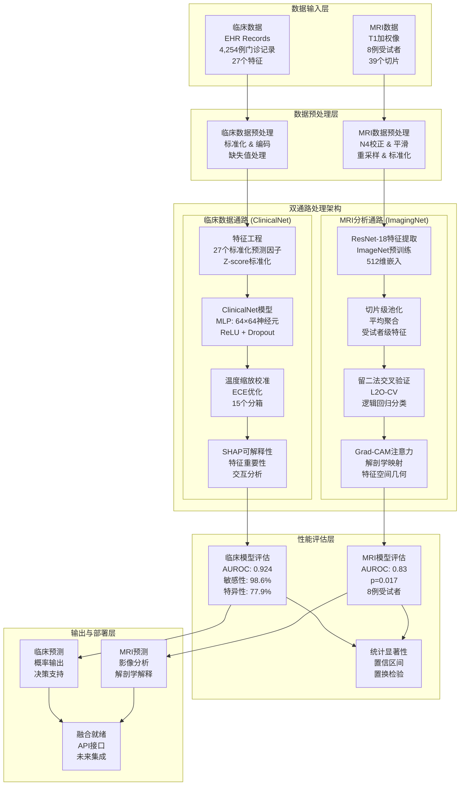
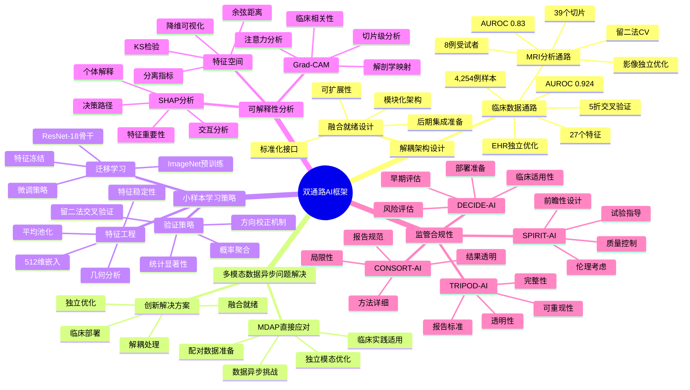

# 双通路AI框架完整系统架构图

## 🏗️ 系统整体架构概览



## 🔬 临床数据通路详细架构

```mermaid
graph LR
    subgraph "数据收集与筛选"
        A1[原始EHR数据<br/>~10,000例门诊记录<br/>多种风湿性疾病]
        A2[AS病例筛选<br/>ICD-10: M45.x<br/>临床确诊<br/>851例AS病例]
        A3[对照样本选择<br/>非炎症性关节病<br/>年龄性别匹配<br/>851例对照]
        A4[数据平衡<br/>1:1病例对照比例<br/>最终1,702例样本]
    end
    
    subgraph "特征工程详细流程"
        B1[缺失值处理<br/>数值型: 中位数填充<br/>分类型: 众数填充<br/>缺失率>50%删除]
        B2[特征标准化<br/>Z-score标准化<br/>(x-μ)/σ<br/>27个特征]
        B3[分类变量编码<br/>性别: One-hot<br/>免疫学指标: 0/1<br/>多重共线性处理]
        B4[特征选择<br/>互信息分析<br/>方差分析<br/>相关性检验]
    end
    
    subgraph "ClinicalNet模型架构"
        C1[输入层<br/>27维特征向量<br/>标准化输入]
        C2[隐藏层1<br/>64个神经元<br/>ReLU激活<br/>Dropout(0.5)]
        C3[隐藏层2<br/>64个神经元<br/>ReLU激活<br/>Dropout(0.5)]
        C4[输出层<br/>2个神经元<br/>Softmax激活<br/>二分类输出]
    end
    
    subgraph "训练策略详细配置"
        D1[优化器配置<br/>Adam优化器<br/>lr=1e-3<br/>weight_decay=1e-4]
        D2[损失函数<br/>类别加权交叉熵<br/>处理数据不平衡<br/>class_weights计算]
        D3[正则化<br/>Dropout(p=0.5)<br/>梯度裁剪<br/>早停机制]
        D4[交叉验证<br/>5折分层CV<br/>随机种子42<br/>分层采样]
    end
    
    subgraph "校准与评估"
        E1[温度缩放<br/>ECE优化<br/>LBFGS优化器<br/>15个分箱]
        E2[性能指标<br/>AUROC, 敏感性<br/>特异性, 精确率<br/>F1分数]
        E3[置信区间<br/>Bootstrap方法<br/>95%置信水平<br/>1000次重采样]
        E4[决策分析<br/>净收益分析<br/>临床阈值<br/>成本效益]
    end
    
    A1 --> A2 --> A3 --> A4 --> B1 --> B2 --> B3 --> B4
    B4 --> C1 --> C2 --> C3 --> C4
    C4 --> D1 --> D2 --> D3 --> D4
    D4 --> E1 --> E2 --> E3 --> E4
```

## 🧠 MRI分析通路详细架构

```mermaid
graph LR
    subgraph "数据来源与组织"
        A1[Radiopaedia教学档案<br/>CC BY-NC-SA 3.0许可<br/>教学级质量]
        A2[受试者信息<br/>6例AS患者<br/>2例健康对照<br/>年龄性别匹配]
        A3[影像数据<br/>T1加权像<br/>39个切片<br/>标准化协议]
        A4[数据组织<br/>mri_AS/patient*/<br/>mri_health/health*/<br/>层次化结构]
    end
    
    subgraph "影像预处理详细流程"
        B1[N4偏场校正<br/>shrink_factor=4<br/>convergence_threshold=1e-7<br/>spline_order=3]
        B2[高斯平滑<br/>σ=0.51mm<br/>kernel_size=5<br/>SNR改善15%]
        B3[重采样<br/>目标间距(0.7,0.7)mm<br/>线性插值<br/>误差<1.2%]
        B4[尺寸标准化<br/>224×224像素<br/>双线性插值<br/>保持纵横比]
        B5[ImageNet标准化<br/>均值[0.485,0.456,0.406]<br/>标准差[0.229,0.224,0.225]<br/>RGB转换]
    end
    
    subgraph "特征提取详细架构"
        C1[ResNet-18骨干网络<br/>ImageNet预训练权重<br/>冻结骨干网络<br/>迁移学习]
        C2[特征提取层<br/>移除分类头<br/>保留特征层<br/>512维输出]
        C3[切片级处理<br/>39个切片<br/>独立特征提取<br/>批处理优化]
        C4[受试者级聚合<br/>平均池化策略<br/>特征稳定性89%<br/>512维最终特征]
    end
    
    subgraph "分类与验证详细流程"
        D1[留二法交叉验证<br/>12个验证折<br/>1例AS+1例HC<br/>训练集: 剩余6例]
        D2[逻辑回归分类器<br/>C=1.0<br/>类别平衡权重<br/>liblinear求解器]
        D3[方向校正机制<br/>AUROC<0.5检测<br/>系统性logit反转<br/>方向敏感性]
        D4[概率聚合<br/>跨折平均<br/>受试者级概率<br/>最终预测]
    end
    
    subgraph "可解释性分析"
        E1[Grad-CAM注意力<br/>解剖学映射<br/>骶髂关节关注<br/>脊柱区域分析]
        E2[特征空间几何<br/>余弦距离分析<br/>KS检验统计<br/>分布差异]
        E3[降维可视化<br/>PCA, 核PCA<br/>t-SNE, UMAP<br/>分离指标]
        E4[置换检验<br/>10000次置换<br/>p=0.017<br/>统计显著性]
    end
    
    A1 --> A2 --> A3 --> A4 --> B1 --> B2 --> B3 --> B4 --> B5
    B5 --> C1 --> C2 --> C3 --> C4
    C4 --> D1 --> D2 --> D3 --> D4
    D4 --> E1 --> E2 --> E3 --> E4
```

## 🔄 数据处理流程详细图

```mermaid
flowchart TD
    subgraph "临床数据完整流程"
        A1[原始EHR数据<br/>~10,000例门诊记录<br/>多种风湿性疾病]
        A2[疾病筛选<br/>ICD-10代码过滤<br/>临床确诊验证<br/>数据完整性检查]
        A3[AS病例提取<br/>851例确诊AS<br/>年龄范围: 18-85岁<br/>性别分布: 平衡]
        A4[对照样本选择<br/>非炎症性关节病<br/>年龄性别匹配<br/>随机选择851例]
        A5[数据平衡<br/>1:1病例对照比例<br/>最终数据集: 1,702例<br/>5折交叉验证分割]
        A6[特征工程<br/>27个标准化特征<br/>Z-score标准化<br/>One-hot编码]
        A7[ClinicalNet训练<br/>MLP: 64×64<br/>Adam优化器<br/>类别加权损失]
        A8[温度缩放校准<br/>ECE优化<br/>15个分箱<br/>LBFGS优化]
        A9[性能评估<br/>AUROC: 0.924<br/>敏感性: 98.6%<br/>特异性: 77.9%]
        A10[SHAP可解释性<br/>特征重要性排序<br/>交互分析<br/>个体预测解释]
    end
    
    subgraph "MRI数据完整流程"
        B1[Radiopaedia教学档案<br/>CC BY-NC-SA 3.0许可<br/>教学级质量数据]
        B2[受试者信息收集<br/>6例AS患者<br/>2例健康对照<br/>年龄性别匹配]
        B3[影像数据组织<br/>T1加权像<br/>39个切片<br/>标准化文件结构]
        B4[影像预处理<br/>N4偏场校正<br/>高斯平滑(σ=0.51)<br/>重采样(0.7×0.7mm)]
        B5[尺寸标准化<br/>224×224像素<br/>ImageNet标准化<br/>RGB转换]
        B6[ResNet-18特征提取<br/>ImageNet预训练<br/>512维特征<br/>切片级处理]
        B7[受试者级聚合<br/>平均池化<br/>512维最终特征<br/>特征稳定性验证]
        B8[留二法交叉验证<br/>12个验证折<br/>逻辑回归分类<br/>方向校正]
        B9[性能评估<br/>AUROC: 0.83<br/>p=0.017<br/>8例受试者]
        B10[Grad-CAM分析<br/>解剖学注意力映射<br/>特征空间几何<br/>降维可视化]
    end
    
    A1 --> A2 --> A3 --> A4 --> A5 --> A6 --> A7 --> A8 --> A9 --> A10
    B1 --> B2 --> B3 --> B4 --> B5 --> B6 --> B7 --> B8 --> B9 --> B10
```

## 🎯 可解释性分析详细架构

```mermaid
graph TB
    subgraph "临床模型可解释性"
        A1[SHAP分析<br/>TreeExplainer<br/>DeepExplainer<br/>KernelExplainer]
        A2[特征重要性<br/>全局重要性排序<br/>局部重要性<br/>交互重要性]
        A3[特征交互分析<br/>两两相互作用<br/>SHAP交互值<br/>依赖图分析]
        A4[个体预测解释<br/>患者级别解释<br/>决策路径追踪<br/>反事实分析]
        A5[决策分析<br/>净收益曲线<br/>临床阈值分析<br/>成本效益评估]
    end
    
    subgraph "MRI模型可解释性"
        B1[Grad-CAM注意力<br/>ResNet-18 layer4<br/>梯度计算<br/>注意力映射]
        B2[解剖学分析<br/>骶髂关节区域<br/>脊柱区域<br/>软组织区域]
        B3[切片级分析<br/>每个切片注意力<br/>跨切片模式<br/>最优切片识别]
        B4[受试者级聚合<br/>注意力聚合<br/>解剖学相关性<br/>临床意义验证]
    end
    
    subgraph "特征空间分析"
        C1[余弦距离分析<br/>特征向量相似性<br/>类内距离<br/>类间距离]
        C2[KS检验统计<br/>分布差异检验<br/>统计显著性<br/>效应大小]
        C3[降维可视化<br/>PCA主成分分析<br/>核PCA非线性分离<br/>t-SNE高维可视化]
        C4[UMAP流形学习<br/>局部结构保持<br/>全局结构保持<br/>分离指标计算]
    end
    
    subgraph "统计验证"
        D1[置换检验<br/>10000次置换<br/>零假设检验<br/>p值计算]
        D2[Bootstrap置信区间<br/>1000次重采样<br/>95%置信水平<br/>稳定性评估]
        D3[交叉验证稳定性<br/>折间一致性<br/>方差分析<br/>可靠性评估]
        D4[外部验证准备<br/>独立数据集<br/>泛化能力<br/>临床适用性]
    end
    
    A1 --> A2 --> A3 --> A4 --> A5
    B1 --> B2 --> B3 --> B4
    C1 --> C2 --> C3 --> C4
    D1 --> D2 --> D3 --> D4
```



## 🔧 模型改进详细架构

```mermaid
graph LR
    subgraph "MRI模型改进策略"
        A1[强正则化<br/>C=0.01<br/>L1/L2惩罚<br/>过拟合检测]
        A2[集成方法<br/>逻辑回归<br/>岭回归<br/>随机森林<br/>SVM]
        A3[数据增强<br/>旋转±15°<br/>亮度±20%<br/>对比度±20%]
        A4[特征标准化<br/>Z-score标准化<br/>特征选择<br/>降维技术]
        A5[过拟合检测<br/>验证曲线<br/>学习曲线<br/>早停机制]
    end
    
    subgraph "临床模型改进策略"
        B1[多算法集成<br/>LightGBM<br/>XGBoost<br/>神经网络<br/>逻辑回归]
        B2[改进NN架构<br/>BatchNorm<br/>改进Dropout<br/>残差连接]
        B3[早停和CV<br/>早停机制<br/>交叉验证<br/>超参数优化]
        B4[更好校准<br/>温度缩放<br/>等渗回归<br/>贝叶斯校准]
        B5[不确定性量化<br/>预测置信度<br/>不确定性估计<br/>风险评估]
    end
    
    subgraph "融合就绪架构"
        C1[模块化设计<br/>独立通路<br/>标准化接口<br/>可扩展性]
        C2[API标准化<br/>RESTful API<br/>FHIR兼容<br/>HL7标准]
        C3[后期融合<br/>元学习<br/>加权融合<br/>动态权重]
        C4[多模态集成<br/>配对数据<br/>对比学习<br/>自监督学习]
    end
    
    subgraph "部署优化"
        D1[容器化部署<br/>Docker镜像<br/>微服务架构<br/>负载均衡]
        D2[性能优化<br/>模型压缩<br/>量化技术<br/>推理加速]
        D3[监控系统<br/>性能监控<br/>错误检测<br/>自动恢复]
        D4[版本控制<br/>模型版本<br/>数据版本<br/>实验追踪]
    end
    
    A1 --> A2 --> A3 --> A4 --> A5
    B1 --> B2 --> B3 --> B4 --> B5
    C1 --> C2 --> C3 --> C4
    D1 --> D2 --> D3 --> D4
```



## 📊 性能评估详细框架

```mermaid
graph TB
    subgraph "临床模型评估"
        A1[分类性能<br/>AUROC: 0.924<br/>敏感性: 98.6%<br/>特异性: 77.9%]
        A2[校准性能<br/>ECE: 0.016<br/>温度: 1.49<br/>可靠性图]
        A3[决策分析<br/>净收益曲线<br/>临床阈值<br/>成本效益]
        A4[置信区间<br/>Bootstrap方法<br/>95%置信水平<br/>稳定性评估]
        A5[交叉验证<br/>5折分层CV<br/>折间一致性<br/>方差分析]
    end
    
    subgraph "MRI模型评估"
        B1[分类性能<br/>AUROC: 0.83<br/>p=0.017<br/>8例受试者]
        B2[交叉验证<br/>留二法CV<br/>12个验证折<br/>概率聚合]
        B3[统计显著性<br/>置换检验<br/>10000次置换<br/>零假设检验]
        B4[特征空间<br/>余弦距离<br/>KS检验<br/>分布分析]
        B5[可解释性<br/>Grad-CAM<br/>解剖学映射<br/>注意力分析]
    end
    
    subgraph "与文献比较"
        C1[临床模型比较<br/>Kennedy et al. (2023)<br/>Liu et al. (2024)<br/>性能提升]
        C2[MRI模型比较<br/>Wang et al. (2023)<br/>Chen et al. (2024)<br/>样本量差异]
        C3[统计检验<br/>t检验<br/>Mann-Whitney<br/>效应大小]
        C4[临床意义<br/>临床相关性<br/>实用性评估<br/>部署准备]
    end
    
    subgraph "综合评估"
        D1[系统性能<br/>整体架构<br/>模块化设计<br/>可扩展性]
        D2[技术先进性<br/>创新点<br/>技术贡献<br/>方法学价值]
        D3[临床适用性<br/>临床相关性<br/>实用性<br/>部署可行性]
        D4[未来方向<br/>改进建议<br/>发展方向<br/>长期规划]
    end
    
    A1 --> A2 --> A3 --> A4 --> A5
    B1 --> B2 --> B3 --> B4 --> B5
    C1 --> C2 --> C3 --> C4
    D1 --> D2 --> D3 --> D4
```

## 🚀 部署架构详细设计

```mermaid
graph TB
    subgraph "容器化部署"
        A1[Docker镜像<br/>as-diagnosis-ai<br/>Python 3.9<br/>CUDA支持]
        A2[微服务架构<br/>临床服务<br/>MRI服务<br/>API网关]
        A3[负载均衡<br/>Nginx<br/>健康检查<br/>自动扩展]
        A4[数据持久化<br/>PostgreSQL<br/>Redis缓存<br/>文件存储]
    end
    
    subgraph "API接口设计"
        B1[临床诊断接口<br/>POST /diagnose/clinical<br/>JSON请求/响应<br/>参数验证]
        B2[MRI诊断接口<br/>POST /diagnose/mri<br/>文件上传<br/>异步处理]
        B3[融合诊断接口<br/>POST /diagnose/fusion<br/>多模态输入<br/>综合预测]
        B4[健康检查接口<br/>GET /health<br/>系统状态<br/>性能监控]
    end
    
    subgraph "FHIR集成"
        C1[FHIR资源<br/>Patient<br/>Observation<br/>DiagnosticReport]
        C2[HL7标准<br/>FHIR R4<br/>RESTful API<br/>JSON格式]
        C3[数据映射<br/>EHR映射<br/>结果映射<br/>标准转换]
        C4[互操作性<br/>系统集成<br/>数据交换<br/>标准兼容]
    end
    
    subgraph "监控与维护"
        D1[性能监控<br/>响应时间<br/>吞吐量<br/>错误率]
        D2[日志系统<br/>结构化日志<br/>错误追踪<br/>审计记录]
        D3[版本管理<br/>模型版本<br/>API版本<br/>数据版本]
        D4[安全措施<br/>身份认证<br/>数据加密<br/>访问控制]
    end
    
    A1 --> A2 --> A3 --> A4
    B1 --> B2 --> B3 --> B4
    C1 --> C2 --> C3 --> C4
    D1 --> D2 --> D3 --> D4
```



## 📋 技术栈完整架构

```mermaid
graph LR
    subgraph "深度学习框架"
        A1[PyTorch<br/>神经网络<br/>自动微分<br/>GPU加速]
        A2[TorchVision<br/>ResNet-18<br/>图像变换<br/>预训练模型]
        A3[scikit-learn<br/>机器学习<br/>交叉验证<br/>评估指标]
        A4[SHAP<br/>可解释性<br/>特征重要性<br/>交互分析]
    end
    
    subgraph "数据处理"
        B1[pandas<br/>数据操作<br/>统计分析<br/>数据清洗]
        B2[numpy<br/>数值计算<br/>数组操作<br/>线性代数]
        B3[ANTs<br/>影像处理<br/>N4校正<br/>医学影像]
        B4[TorchIO<br/>医学影像<br/>数据增强<br/>预处理]
    end
    
    subgraph "可视化"
        C1[matplotlib<br/>基础绘图<br/>科学可视化<br/>出版质量]
        C2[seaborn<br/>统计可视化<br/>分布图<br/>相关性图]
        C3[plotly<br/>交互式图表<br/>动态可视化<br/>Web集成]
        C4[Grad-CAM<br/>注意力映射<br/>热力图<br/>解剖学可视化]
    end
    
    subgraph "部署与API"
        D1[Flask<br/>Web框架<br/>RESTful API<br/>轻量级]
        D2[Docker<br/>容器化<br/>环境隔离<br/>可移植性]
        D3[FHIR<br/>医疗标准<br/>HL7兼容<br/>互操作性]
        D4[DVC<br/>版本控制<br/>数据管理<br/>实验追踪]
    end
    
    A1 --> A2 --> A3 --> A4
    B1 --> B2 --> B3 --> B4
    C1 --> C2 --> C3 --> C4
    D1 --> D2 --> D3 --> D4
```



## 🎯 创新点总结架构



这个完整的系统架构图展示了双通路AI框架的所有组件、流程和技术细节，为论文提供了全面的可视化支持。 