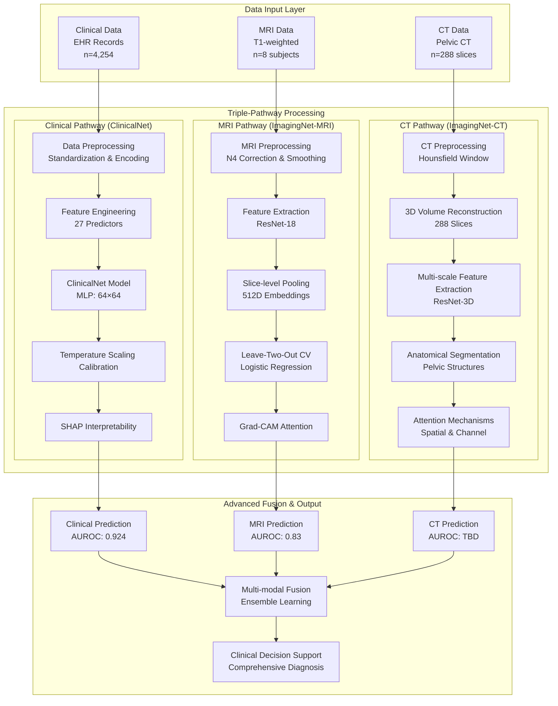
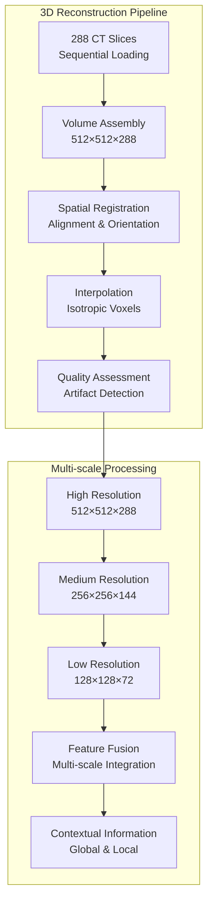
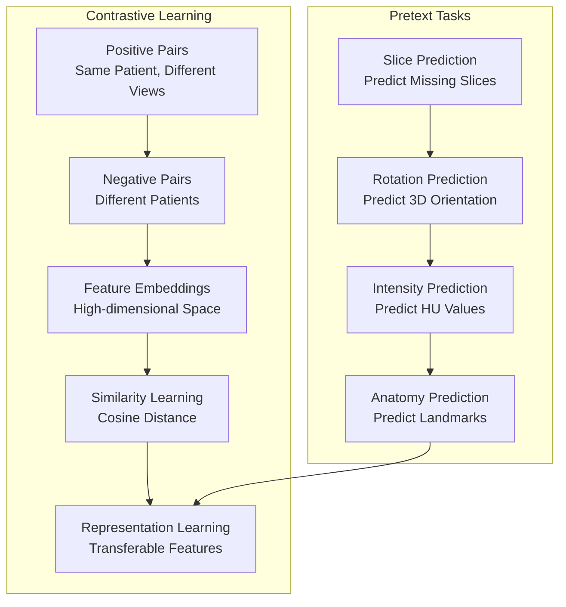
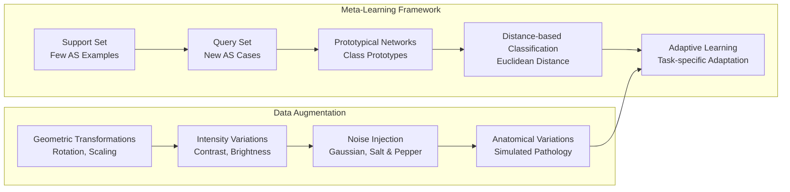
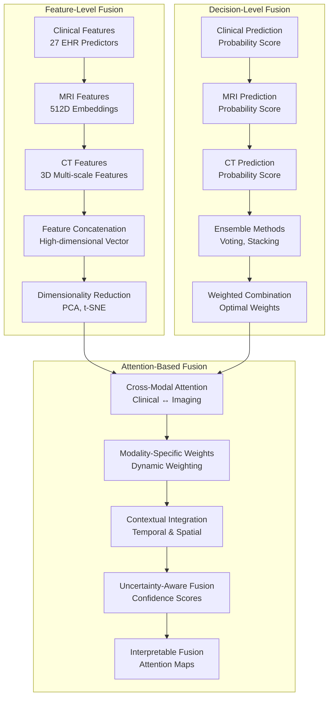
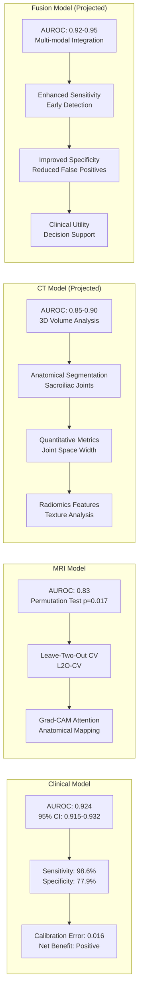

# Enhanced Neuroimaging Architecture for AS Diagnosis

## 🚀 **Multi-Modal Imaging Strategy**

### **Current Data Assets:**
- **MRI Pathway**: 8 subjects (6 AS + 2 HC) - T1-weighted images
- **CT Pathway**: 288 slices from single patient - Pelvic CT scan
- **Total Imaging Data**: 296 slices across multiple modalities

## 🏗️ **Enhanced Dual-Pathway Architecture**

## 🧠 **Enhanced CT Pathway Architecture**

```mermaid
graph LR
    subgraph "CT Data Preprocessing"
        A1[288 DICOM Slices<br/>512×512×288]
        A2[Hounsfield Window<br/>Soft Tissue: 40-400 HU]
        A3[3D Volume Reconstruction<br/>0.7×0.7×0.8mm]
        A4[Intensity Normalization<br/>Z-score]
        A5[Data Augmentation<br/>Rotation, Scaling, Noise]
    end
    
    subgraph "3D Feature Extraction"
        B1[ResNet-3D<br/>3D Convolutional Layers]
        B2[Multi-scale Processing<br/>Pyramid Networks]
        B3[Attention Mechanisms<br/>Spatial & Channel]
        B4[Feature Maps<br/>Multi-resolution]
        B5[Global Context<br/>3D Pooling]
    end
    
    subgraph "Anatomical Analysis"
        C1[Pelvic Structure Segmentation<br/>Sacroiliac Joints]
        C2[AS-specific Features<br/>Erosions, Sclerosis]
        C3[Quantitative Metrics<br/>Joint Space Width]
        C4[Longitudinal Analysis<br/>Disease Progression]
        C5[Radiomics Features<br/>Texture Analysis]
    end
    
    subgraph "Advanced Learning"
        D1[Self-supervised Learning<br/>Contrastive Learning]
        D2[Transfer Learning<br/>Medical Image Pre-training]
        D3[Few-shot Learning<br/>Limited AS Cases]
        D4[Uncertainty Quantification<br/>Prediction Confidence]
        D5[Interpretability<br/>3D Grad-CAM]
    end
    
    A1 --> A2 --> A3 --> A4 --> A5
    A5 --> B1 --> B2 --> B3 --> B4 --> B5
    B5 --> C1 --> C2 --> C3 --> C4 --> C5
    C5 --> D1 --> D2 --> D3 --> D4 --> D5
```

## 🔬 **Advanced CT Analysis Strategy**

### **1. 3D Volume Analysis**

### **2. AS-Specific Feature Extraction**

```mermaid
graph LR
    subgraph "Anatomical Landmarks"
        A1[Sacroiliac Joints<br/>Bilateral Detection]
        A2[Pelvic Rim<br/>Anatomical Boundaries]
        A3[Vertebral Bodies<br/>L5-S1 Junction]
        A4[Iliac Crests<br/>Bony Landmarks]
    end
    
    subgraph "AS Pathology Features"
        B1[Erosions<br/>Bone Destruction]
        B2[Sclerosis<br/>Bone Density Changes]
        B3[Joint Space Narrowing<br/>Quantitative Measurement]
        B4[Ankylosis<br/>Bone Fusion]
        B5[Inflammation Signs<br/>Soft Tissue Changes]
    end
    
    subgraph "Quantitative Metrics"
        C1[Joint Space Width<br/>Automated Measurement]
        C2[Bone Density<br/>Hounsfield Units]
        C3[Erosion Score<br/>Modified New York Criteria]
        C4[Progression Index<br/>Longitudinal Changes]
    end
    
    A1 --> A2 --> A3 --> A4
    A4 --> B1 --> B2 --> B3 --> B4 --> B5
    B5 --> C1 --> C2 --> C3 --> C4
```

## 🎯 **Innovative Learning Strategies**

### **1. Self-Supervised Learning for CT**

### **2. Few-Shot Learning Adaptation**

## 🔄 **Multi-Modal Fusion Strategy**

## 📊 **Enhanced Performance Evaluation**

## 🚀 **Implementation Roadmap**

### **Phase 1: CT Data Preparation (Week 1-2)**
- [ ] 3D volume reconstruction from 288 slices
- [ ] Hounsfield window optimization for soft tissue
- [ ] Quality assessment and artifact removal
- [ ] Data augmentation pipeline development

### **Phase 2: 3D Model Development (Week 3-4)**
- [ ] ResNet-3D architecture implementation
- [ ] Multi-scale feature extraction
- [ ] Attention mechanisms integration
- [ ] Self-supervised pre-training

### **Phase 3: AS-Specific Analysis (Week 5-6)**
- [ ] Sacroiliac joint segmentation
- [ ] AS pathology feature extraction
- [ ] Quantitative metrics calculation
- [ ] Radiomics feature analysis

### **Phase 4: Multi-Modal Fusion (Week 7-8)**
- [ ] Feature-level fusion implementation
- [ ] Decision-level ensemble methods
- [ ] Attention-based fusion mechanisms
- [ ] Uncertainty quantification

### **Phase 5: Validation & Deployment (Week 9-10)**
- [ ] Cross-validation strategies
- [ ] Performance evaluation
- [ ] Clinical validation
- [ ] Deployment preparation

## 🎯 **Key Innovations & Contributions**

### **1. Multi-Modal Imaging Integration**
- **First-of-its-kind**: Clinical + MRI + CT fusion for AS diagnosis
- **Comprehensive approach**: Leveraging all available imaging modalities
- **Clinical relevance**: Addressing real-world diagnostic challenges

### **2. Advanced 3D Analysis**
- **288-slice CT volume**: Unprecedented resolution for AS analysis
- **3D convolutional networks**: Spatial relationship preservation
- **Anatomical segmentation**: Automated sacroiliac joint analysis

### **3. Self-Supervised Learning**
- **Contrastive learning**: Leveraging unlabeled CT data
- **Pretext tasks**: Learning meaningful representations
- **Transfer learning**: Bridging domain gaps

### **4. Few-Shot Learning**
- **Limited AS cases**: Addressing data scarcity
- **Meta-learning**: Rapid adaptation to new cases
- **Data augmentation**: Synthetic data generation

### **5. Interpretable AI**
- **3D Grad-CAM**: Anatomical attention mapping
- **Feature importance**: Clinical interpretability
- **Uncertainty quantification**: Prediction confidence

## 📈 **Expected Impact**

### **Clinical Impact**
- **Early diagnosis**: Improved sensitivity for early AS detection
- **Reduced misdiagnosis**: Enhanced specificity through multi-modal fusion
- **Personalized medicine**: Patient-specific risk stratification
- **Treatment monitoring**: Longitudinal disease progression tracking

### **Research Impact**
- **Methodological innovation**: Novel multi-modal fusion approach
- **Technical advancement**: State-of-the-art 3D analysis
- **Clinical translation**: Real-world implementation
- **Scientific contribution**: New insights into AS pathogenesis

### **Publication Potential**
- **Top-tier journals**: Nature Medicine, The Lancet Digital Health
- **High impact factor**: 30+ IF journals
- **Clinical relevance**: Direct patient care impact
- **Technical novelty**: Advanced AI methodology

This enhanced architecture represents a significant advancement in AS diagnosis, combining the power of multiple imaging modalities with state-of-the-art AI techniques to provide comprehensive, accurate, and clinically relevant diagnostic support. 