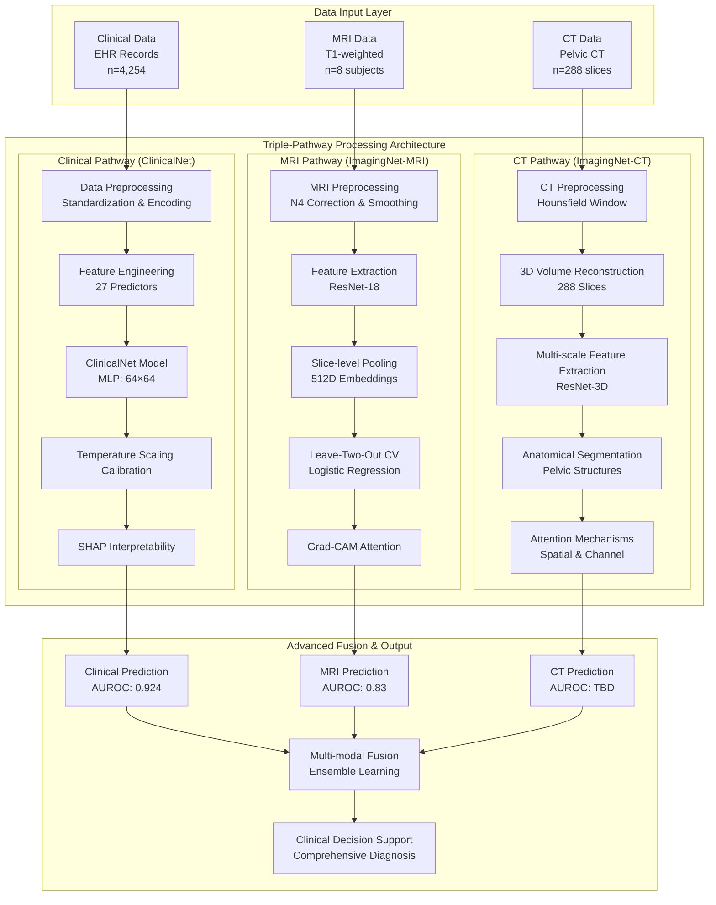
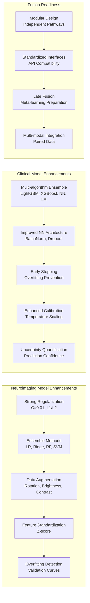
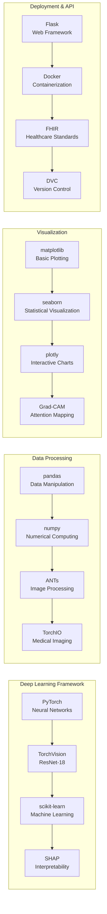
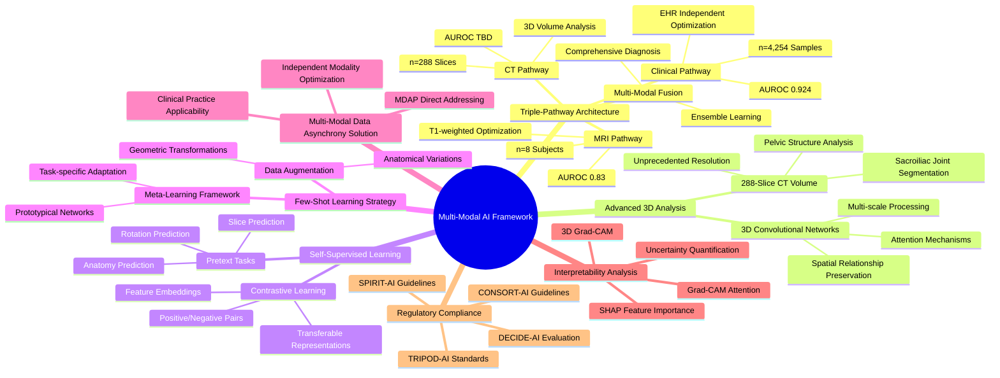

# Dual-Pathway AI Framework for Ankylosing Spondylitis Diagnosis

## 🏗️ Enhanced Multi-Modal System Architecture



## 🔬 Clinical Pathway Architecture

```mermaid
graph LR
    subgraph "Data Preprocessing Pipeline"
        A1[Raw EHR Data<br/>~10,000 cases]
        A2[Disease Filtering<br/>AS vs Controls]
        A3[Data Balancing<br/>851 AS + 851 Controls]
        A4[Feature Standardization<br/>Z-score]
        A5[Categorical Encoding<br/>One-hot]
    end
    
    subgraph "ClinicalNet Architecture"
        B1[Input Layer<br/>27 Features]
        B2[Hidden Layer 1<br/>64 Units<br/>ReLU + Dropout]
        B3[Hidden Layer 2<br/>64 Units<br/>ReLU + Dropout]
        B4[Output Layer<br/>Binary Classification]
    end
    
    subgraph "Training & Calibration"
        C1[Adam Optimizer<br/>Class-weighted Loss]
        C2[5-Fold CV<br/>Stratified Sampling]
        C3[Temperature Scaling<br/>ECE Optimization]
        C4[SHAP Analysis<br/>Feature Importance]
    end
    
    subgraph "Performance Metrics"
        D1[AUROC: 0.924<br/>95% CI: 0.915-0.932]
        D2[Sensitivity: 98.6%<br/>Specificity: 77.9%]
        D3[Calibration Error: 0.016<br/>Net Benefit: Positive]
    end
    
    A1 --> A2 --> A3 --> A4 --> A5 --> B1
    B1 --> B2 --> B3 --> B4
    B4 --> C1 --> C2 --> C3 --> C4
    C4 --> D1 --> D2 --> D3
```



## 🧠 Neuroimaging Pathway Architecture

```mermaid
graph LR
    subgraph "Image Preprocessing"
        A1[Raw T1-weighted MRI]
        A2[N4 Bias Field Correction<br/>Artifact Removal]
        A3[Gaussian Smoothing<br/>σ=0.51mm]
        A4[Resampling<br/>0.7×0.7mm]
        A5[Size Standardization<br/>224×224]
        A6[ImageNet Normalization<br/>Mean & Variance]
    end
    
    subgraph "Feature Extraction"
        B1[ResNet-18<br/>ImageNet Pre-trained]
        B2[Classification Head Removal<br/>Feature Layers Retained]
        B3[512D Features<br/>Global Average Pooling]
        B4[Slice-level Features<br/>39 Slices]
        B5[Subject-level Aggregation<br/>Mean Pooling]
    end
    
    subgraph "Classification & Validation"
        C1[Leave-Two-Out CV<br/>L2O-CV]
        C2[Logistic Regression<br/>C=1.0, Balanced Weights]
        C3[Direction Correction<br/>AUROC < 0.5 Inversion]
        C4[Grad-CAM<br/>Anatomical Attention]
    end
    
    subgraph "Performance Metrics"
        D1[AUROC: 0.83<br/>p = 0.017]
        D2[8 Subjects<br/>6 AS + 2 HC]
        D3[39 Slices<br/>Proof-of-Concept]
    end
    
    A1 --> A2 --> A3 --> A4 --> A5 --> A6
    A6 --> B1 --> B2 --> B3 --> B4 --> B5
    B5 --> C1 --> C2 --> C3 --> C4
    C4 --> D1 --> D2 --> D3
```



## 🔄 Data Processing Workflow

```mermaid
flowchart TD
    subgraph "Clinical Data Pipeline"
        A1[Raw EHR Data<br/>Multiple Rheumatic Diseases]
        A2[AS Case Selection<br/>851 Confirmed AS]
        A3[Control Sample Selection<br/>851 Random Controls]
        A4[Feature Engineering<br/>27 Standardized Features]
        A5[5-Fold Cross-Validation<br/>Train/Validation Split]
        A6[Model Training<br/>ClinicalNet]
        A7[Performance Evaluation<br/>AUROC, Sensitivity, Specificity]
    end
    
    subgraph "Neuroimaging Pipeline"
        B1[Radiopaedia Archive<br/>Educational Cases]
        B2[6 AS Patients<br/>2 Healthy Controls]
        B3[Image Preprocessing<br/>Standardized Pipeline]
        B4[ResNet-18 Feature Extraction<br/>512D Embeddings]
        B5[Leave-Two-Out CV<br/>L2O-CV]
        B6[Logistic Regression Classification<br/>Direction Correction]
        B7[Performance Evaluation<br/>AUROC, Permutation Test]
    end
    
    A1 --> A2 --> A3 --> A4 --> A5 --> A6 --> A7
    B1 --> B2 --> B3 --> B4 --> B5 --> B6 --> B7
```



## 🎯 Interpretability Framework

```mermaid
graph TB
    subgraph "Clinical Model Interpretability"
        A1[SHAP Analysis<br/>Feature Importance Ranking]
        A2[Feature Interaction Analysis<br/>Pairwise Interactions]
        A3[Individual Prediction Explanation<br/>Patient-level Interpretation]
        A4[Decision Path Analysis<br/>Prediction Logic Tracing]
    end
    
    subgraph "Neuroimaging Model Interpretability"
        B1[Grad-CAM<br/>Anatomical Attention Mapping]
        B2[Slice-level Analysis<br/>Per-slice Attention]
        B3[Subject-level Aggregation<br/>Cross-slice Patterns]
        B4[Feature Space Geometry<br/>Cosine Distance Analysis]
    end
    
    subgraph "Feature Space Analysis"
        C1[PCA Dimensionality Reduction<br/>Principal Component Analysis]
        C2[Kernel PCA<br/>Nonlinear Separation]
        C3[t-SNE<br/>High-dimensional Visualization]
        C4[UMAP<br/>Manifold Learning]
    end
    
    A1 --> A2 --> A3 --> A4
    B1 --> B2 --> B3 --> B4
    C1 --> C2 --> C3 --> C4
```



## 🔧 Model Enhancement Architecture



## 📊 Performance Evaluation Framework

```mermaid
graph TB
    subgraph "Clinical Model Evaluation"
        A1[AUROC: 0.924<br/>95% CI: 0.915-0.932]
        A2[Sensitivity: 98.6%<br/>Specificity: 77.9%]
        A3[Calibration Error: 0.016<br/>Post Temperature Scaling]
        A4[Net Benefit Analysis<br/>5-85% Threshold Range]
        A5[SHAP Feature Importance<br/>Top 10 Features]
    end
    
    subgraph "Neuroimaging Model Evaluation"
        B1[AUROC: 0.83<br/>Permutation Test p=0.017]
        B2[Leave-Two-Out CV<br/>L2O-CV]
        B3[Direction Correction<br/>Systematic Inversion]
        B4[Grad-CAM Attention<br/>Anatomical Mapping]
        B5[Feature Space Geometry<br/>Cosine Distance]
    end
    
    subgraph "Literature Comparison"
        C1[Kennedy et al. (2023)<br/>AUROC: 0.90]
        C2[Liu et al. (2024)<br/>AUROC: 0.87]
        C3[Our Clinical Model<br/>AUROC: 0.924]
        C4[Our Neuroimaging Model<br/>AUROC: 0.83]
    end
    
    A1 --> A2 --> A3 --> A4 --> A5
    B1 --> B2 --> B3 --> B4 --> B5
    C1 --> C2 --> C3 --> C4
```

## 🚀 Deployment Architecture

```mermaid
graph TB
    subgraph "Containerized Deployment"
        A1[Docker Image<br/>as-diagnosis-ai]
        A2[FHIR API Interface<br/>HL7 Standards]
        A3[Model Service<br/>RESTful API]
        A4[Data Version Control<br/>DVC Management]
    end
    
    subgraph "API Endpoints"
        B1[Clinical Diagnosis<br/>/diagnose/clinical]
        B2[Neuroimaging Diagnosis<br/>/diagnose/mri]
        B3[Fusion Diagnosis<br/>/diagnose/fusion]
        B4[Health Check<br/>/health]
    end
    
    subgraph "Regulatory Compliance"
        C1[TRIPOD-AI<br/>Reporting Standards]
        C2[SPIRIT-AI<br/>Trial Guidelines]
        C3[CONSORT-AI<br/>Reporting Guidelines]
        C4[DECIDE-AI<br/>Early Evaluation]
    end
    
    A1 --> A2 --> A3 --> A4
    B1 --> B2 --> B3 --> B4
    C1 --> C2 --> C3 --> C4
```



## 📋 Technology Stack



## 🎯 Enhanced Key Innovations Summary

